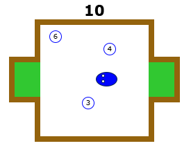
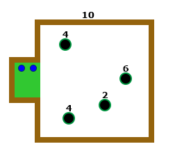
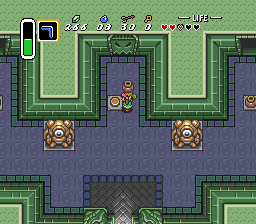

#### Idee 1: Snakeabwandlung

Ziel des Spiels ist es die passenden Zahlen zu fressen um eine gewünschte Zahl zu bekommen. Wenn man der Ansicht ist, man hat die richtige Zahl, geht man mit der Schlange ins Ziel zur Auswertung.

Auch möglich: Schlange muss Zahlen und Mathematische Operatoren fressen um zur gesuchten Zahl zu kommen. Dabei gilt das Spiel als verloren, wenn die eingegebene Gleichung keinen Sinn ergibt, das Ergebnis nicht stimmt oder man wie üblich in ein Hindernis gelaufen ist.

#### Idee 2: Addition über Kugeln/Murmeln

Es gibt verschiedene Löcher, die nummeriert sind. Der Spieler muss Kugeln in die passenden Löcher legen, die dann über einen kleinen Parcour rollen und am Ende sieht man ob man durch diese beiden Löcher die richtige Zahl addiert hat.

#### Idee 3: Zahlen werfen

Statt wie bei Math Smashers die Zahlen zusammen zu ziehen, könnte man die Zahlen als "Steine" modelieren, die man als Spieler aufheben kann und aufeinander werfen muss um sie zu kombinieren. Das könnte dann zur Folge haben, dass dieser Block aus einem besseren Material wird, was man für kleine Bauklotzartige Gebäude benötigt.

Das Spielfeld an sich könnte ähnlich wie bei dem Snake-Spiel aussehen nur ist die Zahl, die man addieren soll ein Bauklotz in einem Bauwerk.

Vom Stil her könnte man das wie in Zelda machen, siehe hier:

Der Spieler trägt also einen Stein und wirft ihn/setzt ihn auf einen anderen um ihn zu kombinieren. Wenn er mit dem Ergebnis zufrieden ist, setzt er ihn auf die markierte Stelle im Ergebnisbereich.
